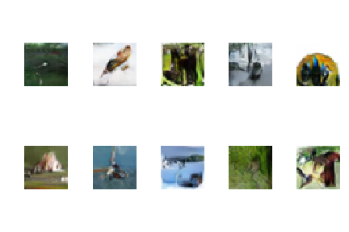

# Generative Adversarial Network using CIFAR10 Dataset
This repository exists to serve as a reference point for budding AI enthusiasts, especially those who do not have access to necessary compute power.
Most online resources provide the final working code sample, that generates required output but does not demonstrate effect of tweaking the architecure / parameters. I'm hoping that the trials and results demonstrated in this repo provides insights regarding the various techniques and their consequences in building GANs.

## Gan Debugging Tips - based on personal experience
1. If the generated images are overly light / dark, it could mean that the output images are not scaled. This is especially true if using tanh activation in generator's output layer. Use reverse of the operation used for input scaling.
1. In early epochs, similar repeated patterns in the generated images is a good indicator that the model has reached the point of no return.
1. Very low loss for discriminator is a great indicator of failure.
1. Train the discriminator (D) on real and fake samples separately. Training D from using a subset of mixed samples leads to failure.

## Results
Please check individual trial folders for changes and their effects:
1. [Trail1](cifar10_trial1)
1. [Trail2](cifar10_trial2)
1. [Trail3](cifar10_trial3)

Final image generated from latest trial:

<kbd></kbd>

## Contributing
You can contribute to this repo by
1. Suggesting incremental changes to the trials. I will be happy to implement them and discuss the results.
1. Suggesting methods to improve the documentation.

## References
1. Code structure inspired by [this article](https://machinelearningmastery.com/how-to-develop-a-generative-adversarial-network-for-a-cifar-10-small-object-photographs-from-scratch/)
1. TowardsDataScience [article](https://towardsdatascience.com/deeper-into-dcgans-2556dbd0baac) on general guidelines.
1. ganhacks [repo](https://github.com/soumith/ganhacks), [article](https://machinelearningmastery.com/how-to-code-generative-adversarial-network-hacks/)
1. Similar implementation on Github: [link](https://github.com/mafda/generative_adversarial_networks_101/blob/master/src/cifar10/02_DCGAN_CIFAR10.ipynb)

## Acknowledgment
I am extremely grateful to Intuit for allowing me to open-source this project.
