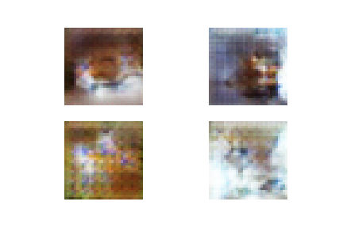
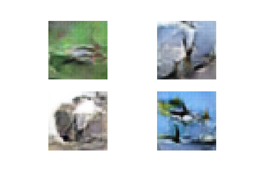
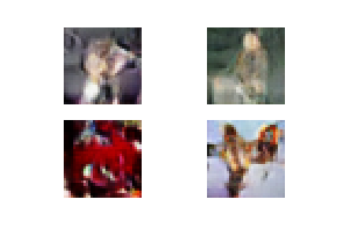

### Trial 1

#### Model Architecure
1. Discriminator:
   - Input dimension: (32,32,3)
   - 2 2D Convolutional layers - [ filters: 128x(3,3), stride=(2,2), padding='same' ]
   - Each Convolutional layer is followed by BatchNormalization and LeakyReLU(alpha=0.2)
   - The activations are passed through a Flatten() layer
   - The ouput layer is a Dense layer with 1 unit (to predict real / fake), and sigmoid activation
   - Loss: binary_crossentropy
   - Optimizer: Adam(lr=0.0002, beta_1=0.5)
   - Output dimension: (1,1)

2. Generator:
   - Input dimension: 100 (latent input dimension)
   - First hidden layer: (128x8x8) nodes
   - Followed by BatchNormalization and LeakyReLU(alpha=0.2)
   - The output is reshaped to (8,8,128)
   - 2 2D Transpose Convolutional layers - [ filters: 128x(4,4), stride=(2,2), padding='same' ]
   - Each Transpose Convolutional layer is followed by BatchNormalization and LeakyReLU(alpha=0.2)
   - The output layer is a 2D Convolutional layer - [ filters: 3x(5,5), padding='same', activation='sigmoid' ]
   - Output dimension: (32,32,3)

#### Results
- Epoch 50 
   <kbd></kbd>

- Epoch 100 
   <kbd></kbd>

- Epoch 200 
   <kbd></kbd>
