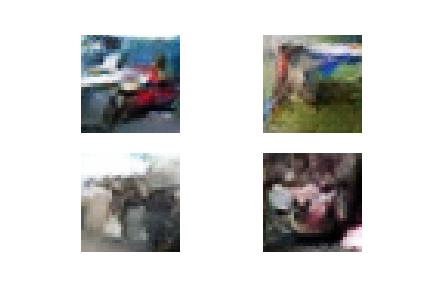

## Trial 2
### Changes
1. General:
   - Trains for 500 epochs (Trial 1 had 200 epochs)
1. Generator:
   - Replaces LeakyReLU in Trial1 with **ReLU**.
   - Replaces **sigmoid** with **tanh** as the output layer activation function.

### Results
- Epoch 50 
   <kbd></kbd>

- Epoch 100 
   <kbd></kbd>

- Epoch 200 
   <kbd></kbd>

- Epoch 300 
   <kbd></kbd>

- Epoch 400 
   <kbd></kbd>

- Epoch 500 
   <kbd></kbd>
