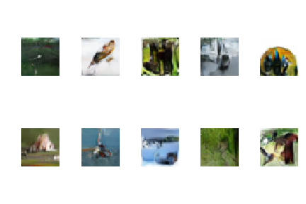

## Trial 3
### Changes
1. General:
   - Used **label smoothing** - Real samples are randomly assigned a value between 0.8 and 1.2. Fake samples are assigned a value between 0 and 0.3
   - Removed unused code
   - Changed image sampling to display 10 images instead of 4.
   - Logged train and test history.
2. Generator:
   - Added **layer weight initializer** [ RandomNormal(mean=0.0, stddev=0.02) ]
   - Ouput layer filter size reduced from (5,5) to (4,4)
3. Discriminator:
   - Added Conv2D input layer in D with 64 filters.

### Observation
- This was the most stable training yet, with G loss and D loss around 0.5.

### Results
- Epoch 50 
   <kbd></kbd>

- Epoch 100 
   <kbd></kbd>

- Epoch 200 
   <kbd></kbd>
